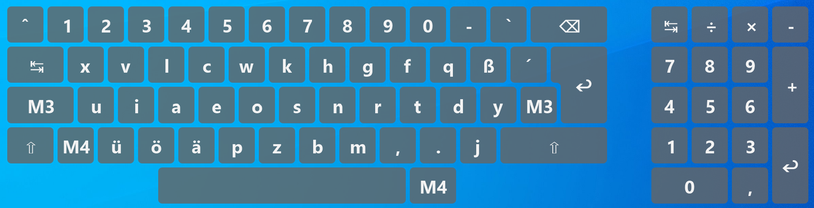

# ReNeo – Die Neo-Tastaturlayouts für Windows

ReNeo implementiert das [Neo-Tastaturlayout](http://neo-layout.org/) und seine Verwandten für Windows. Dabei kann man sich für eine von zwei Varianten entscheiden:
1. Im *Standalone-Modus* ersetzt ReNeo alle Tastendrücke des nativen Layouts (meistens QWERTZ) durch das gewünschte Neo-Layout. Dafür muss zum Systemstart nur die ReNeo-EXE ausgeführt werden.
2. Im *Erweiterungsmodus* installiert man einen nativen Neo-Treiber wie [kbdneo](https://neo-layout.org/Einrichtung/kbdneo/). ReNeo ergänzt dann alle Funktionen, die nativ nicht umsetzbar sind (Capslock, Steuertasten auf Ebene 4, Compose, ...).

## Installation
1. *Optional*: [kbdneo](https://neo-layout.org/Einrichtung/kbdneo/) normal installieren
2. [Neuesten ReNeo-Release](https://github.com/Rojetto/ReNeo/releases/latest) herunterladen und in ein Verzeichnis mit Schreibrechten entpacken (z. B. `C:\Users\[USER]\ReNeo`)
3. `reneo.exe` starten oder zu Autostart hinzufügen. Über das Trayicon kann das Programm deaktiviert und beendet werden.
4. *Optional*: [`config.json` anpassen](#Allgemeine-Konfiguration) (wird beim ersten Start generiert)

*Update*

Neuen Release herunterladen und vorhandene Dateien mit den neuen überschreiben. Da `config.json` nicht im Release enthalten ist, bleiben Nutzereinstellungen erhalten.

*Deinstallation*
1. *Optional*: kbdneo nach Wiki-Anleitung deinstallieren
2. ReNeo-Verzeichnis löschen und aus Autostart entfernen

## Funktionen

Allgemein:
- Unterstützt die Layouts *Neo*, *Bone*, *NeoQwertz*, *Mine*, *AdNW*, *KOY*
- Im Traymenü kann zwischen Layouts gewechselt werden
- Capslock (beide Shift-Tasten) und Mod4-Lock (beide Mod4-Tasten)
- **Bildschirmtastatur**: Wird über Tray-Menü ein- und ausgeschaltet oder per Shortcut `M3+F1`. Wechselt zwischen Ebenen, wenn Modifier gedrückt werden.
- *Alle* tote Tasten und Compose-Kombinationen. Diese sind auch durch den Nutzer erweiterbar, alle `.module`-Dateien im Verzeichnis `compose/` werden beim Start geladen.
- Spezial-Compose-Sequenzen
    - Unicode-Eingabe: `♫uu[codepoint hex]<space>` fügt Unicode-Zeichen ein. Beispiel: `♫uu1f574<space>` → 🕴
    - Römische Zahlen: `♫rn[zahl]<space>` für kleine Zahlen, `♫RN[zahl]<space>` für große Zahlen zwischen 1 und 3999. Beispiel: `♫rn1970<space>` → ⅿⅽⅿⅼⅹⅹ, `♫RN1970<space>` → ⅯⅭⅯⅬⅩⅩ
- `Shift+Pause` (de)aktiviert die Anwendung
- Weitere Layouts können in `layouts.json` hinzugefügt und angepasst werden

Als Erweiterung zum nativen Treiber:
- Steuertasten auf Ebene 4
- Wird das native Layout als Neo-verwandt erkannt (`kbdneo.dll`, `kbdbone.dll`, `kbdgr2.dll`), schaltet ReNeo automatisch in den Erweiterungs-Modus. Umschalten zwischen Layouts ist ganz normal möglich.
- Verbesserte Kompatibilität mit Qt- und GTK-Anwendungen. Workaround für [diesen Bug](https://git.neo-layout.org/neo/neo-layout/issues/510).
- Compose-Taste `M3+Tab` sendet keinen Tab mehr an Anwendung. Workaround für [diesen Bug](https://git.neo-layout.org/neo/neo-layout/issues/397).

## Konfiguration

ReNeo kann mit zwei Konfigurationsdateien angepasst werden.

### Allgemeine Konfiguration
`config.json` hat folgende Optionen:
- `"standaloneMode"`:
    - `true` (Standard): Das native Layout (z. B. QWERTZ) wird von ReNeo mit dem ausgewählten Neo-Layout ersetzt. Hinweis: ist das native Layout bereits Neo-verwandt, verändert ReNeo das Layout nicht und schaltet stattdessen automatisch in den Erweiterungsmodus.
    - `false`: Ist das native Layout Neo-verwandt, schaltet ReNeo in den Erweiterungsmodus. Bei allen anderen Layouts deaktiviert sich ReNeo automatisch.
- `"standaloneLayout"`: Layout, das für den Standalone-Modus genutzt werden soll. Auch übers Traymenü auswählbar.
- `"osk"`:
    - `"numpad"`: Soll Numpad in Bildschirmtastatur angezeigt werden?
    - `"theme"`: Farbschema für Bildschirmtastatur. Mögliche Werte: `"Grey"`, `"NeoBlue"`
- `"sendKeyMode"`: *Experimentell*. 
    - `fakeNative` (Standard): Buchstaben und Sonderzeichen, die im nativen Layout existieren, werden über entsprechende Tastenanschläge und -kombinationen simuliert. So sieht es für Anwendungen aus, als ob  das native Layout ganz normal verwendet wird.
    - `honest`: Sonderzeichen werden grundsätzlich als Unicode-Pakete gesendet.

### Layouts anpassen
In `layouts.json` können Layouts angepasst und hinzugefügt werden. Jeder Eintrag besitzt folgende Parameter:
- `"name"`: Name des Layouts, so wie er im Menü angezeigt wird.
- `"dllName"` (Optional): Name der zugehörigen nativen Treiber-DLL. Existiert diese nicht, kann der Parameter weggelassen werden.
- `"modifiers"`: Scancodes der Modifier Shift, Mod3 und Mod4 (links und rechts). Mit `+` am Ende wird das Extended-Bit gesetzt, zum Beispiel `36+` für die rechte Shift-Taste.
- `"capslockableKeys"`: Array von Scancodes, die von Capslock beeinflusst werden sollen. Typischerweise sind das alle Buchstaben, inklusive „äöüß“.
- `"map"`: Das tatsächliche Layout in Form von Arrays mit 6 Elementen (für die 6 Ebenen) für jeden Scancode. Jeder Eintrag enthält dabei
    - `"keysym"`: X11-Keysym der Taste, entweder aus `keysymdef.h` oder in der Form `U1234` für Unicode-Zeichen. Wird für Compose benutzt.
    - **Entweder** `"vk"`: Windows Virtual Key aus dem Enum `VKEY` in `mapping.d`. Nur genutzt für Steuertasten.
    - **Oder** `"char"`: Unicode-Zeichen, das mit der Taste erzeugt werden soll.
    - `"label"`: (Optional) Beschriftung für Bildschirmtastatur. Als Fallback wird der Wert von `"char"` genutzt.

Zum Erstellen neuer Layouts hat sich folgender Arbeitsablauf bewährt:
1. Bestehendes Layout kopieren und neuen Namen eintragen
2. Die Zeilen der Buchstabentasten (also ab Scancode `0C`) neu ordnen, sodass diese auf der Tastatur von oben links nach unten rechts gelesen in der richtigen Reihenfolge sind.
3. Mit Blockauswahl die Scancodes eines bestehenden Layouts kopieren, und die (jetzt falsch geordneten) Scancodes des neuen Layouts überschreiben.
4. Mit Blockauswahl Ebenen 3 und 4 eines bestehenden Layouts kopieren, und Ebenen 3 und 4 des neuen Layouts überschreiben.
5. `modifiers` und `capslockableKeys` ggf. anpassen

So bleiben Ebenen 3 und 4 an der richtigen Stelle, und die anderen Ebenen werden nach der neuen Buchstabenanordnung permutiert.

## Vergleich vorhandener Windows-Treiber
| Feature                               | ReNeo (Standalone) | ReNeo+kbdneo | AHK+kbdneo | NeoVars |
| ------------------------------------- | ------------------ | ------------ | ---------- | ------- |
| Unterstützte Layouts                  | 🟢                  | 🟡            | 🟡          | 🟡 1     |
| Compose                               | 🟢                  | 🟢            | 🟠          | 🟡       |
| Admin-Rechte                          | 🟢                  | 🟡            | 🟡          | 🟢       |
| Zusammenspiel mit nativem Layout      | 🟢 2                | 🟢            | 🟠          | 🟠 3     |
| Anmeldebildschirm & Admin-Anwendungen | 🟡                  | 🟢            | 🟢          | 🟡       |
| Kompatibilität                        | 🟢                  | 🟢            | 🟡 4        | 🟡 5     |
| Bildschirmtastatur                    | 🟢                  | 🟢            | 🟡          | 🟡       |
| Extra-Features                        | 🟠                  | 🟠            | 🟠          | 🟢 6     |

1. Buchstabenanordnung kann zwar vertauscht werden, sonst ist Anpassung aber schwer
2. Verträgt sich mit den meisten Layouts (QWERTZ, QWERTY, QWERTZ-CH), inklusive IMEs wie Chinesisch/Japanisch (eingeschränkt). Umschalten ist in Windows ganz normal möglich.
3. QWERTZ muss aktiv sein und in der Liste an erster Stelle stehen
4. siehe o.g. Bugs
5. Key-Events „klappern“ bei Sonderzeichen, Steuertasten gehen nicht überall
6. Einhandmodus, ſ-Modus, Taschenrechner, ...

# Virtuelle Maschinen und Remote Desktop
Sobald mehrere „ineinander“ laufende Betriebssysteme ins Spiel kommen, wird es mit alternativen Tastaturlayouts fast immer haarig.
Da sich die verschiedenen VM-Programme und Remote Desktop Clients unterschiedlich verhalten, gibt es leider keine universelle Lösung, sondern nur eine grundsätzliche Empfehlung und ein paar erprobte Konfigurationen.

Für beste Kompatibilität sollte im Allgemeinen das *innerste* System das Alternativlayout übernehmen, und in allen äußeren Systeme QWERTZ eingestellt sein.
Bei VMs bedeutet das QWERTZ im Wirt und den passenden Neo-Treiber im Gast.
Im Fall von Remote-Desktop-Verbindungen heißt es QWERTZ lokal und einen Neo-Treiber im Remote-System.

## WSL mit VcXsrv als X-Server

In Windows QWERTZ (ohne ReNeo), dann das Neo-Layout in X11 einstellen. Für Neo lautet der Befehl `setxkbmap de neo`, für andere Layouts muss eventuell noch eine passende xkbmap installiert werden.

## VirtualBox

Im Wirtsystem QWERTZ einstellen, dann Neo-Treiber (z. B. ReNeo) im Gastsystem installieren.

## [Remote Desktop Manager](https://remotedesktopmanager.com/)

Es geht offenbar auch ReNeo im Standalone-Modus auf dem lokalen System mit QWERTZ auf dem Remote-System. Zumindest Buchstaben und (nicht-Unicode)-Sonderzeichen werden dann auf die Remote-Systeme korrekt weitergeleitet.

# Für Entwickler
## Kompilieren
ReNeo ist in D geschrieben und nutzt `dub` für Projektkonfiguration und Kompilation.
Es gibt zwei wichtige Kompilationsvarianten:
1. Debug mit `dub build`: Neben Debuggingsymbolen öffnet die generierte EXE eine Konsole um Informationen ausgeben zu können.
2. Release mit `dub build --build=release`: Optimierungen sind aktiviert und es wird keine Konsole geöffnet.

Die Ressourcendatei `res/reneo.res` wird mit `rc.exe` aus dem Windows SDK erstellt (x86-Version, die generierte res-Datei funktioniert sonst nicht). Dazu reicht der Befehl `rc.exe reneo.rc`.

Cairo-DLL stammt von https://github.com/preshing/cairo-windows. Die zugehörigen D-Header wurden mit [DStep](https://github.com/jacob-carlborg/dstep) aus den C-Headern generiert und manuell angepasst.

## Release
1. Build mit `dub build --build=release`
2. Erstelle Zip-Datei mit Name `ReNeo_vX.Y.Z.zip`. Inhalt: `reneo.exe`, `README.md`, `COPYING`, `keysymdef.h`, `config.default.json` (Layout-Voreinstellung anpassen), `layouts.json`, `cairo.dll`, `compose/`
3. Neuen Release auf GitHub. Änderungen seit letzter Version raussuchen.

# Bibliotheken
Nutzt [Cairo](https://www.cairographics.org/), lizensiert unter der GNU Lesser General Public License (LGPL) Version 2.1.