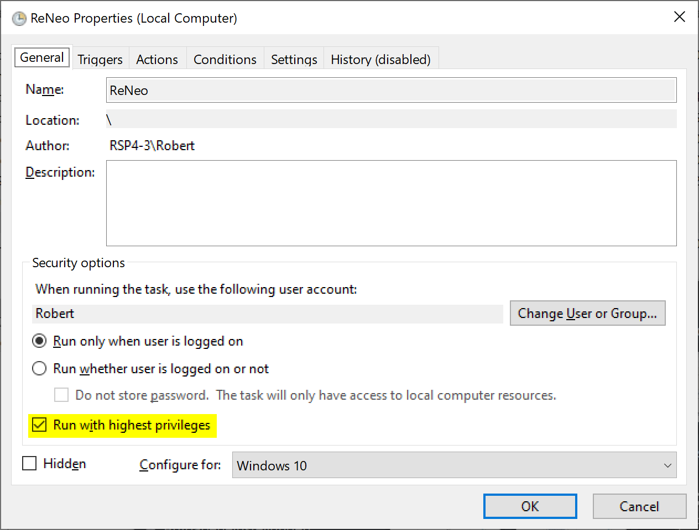
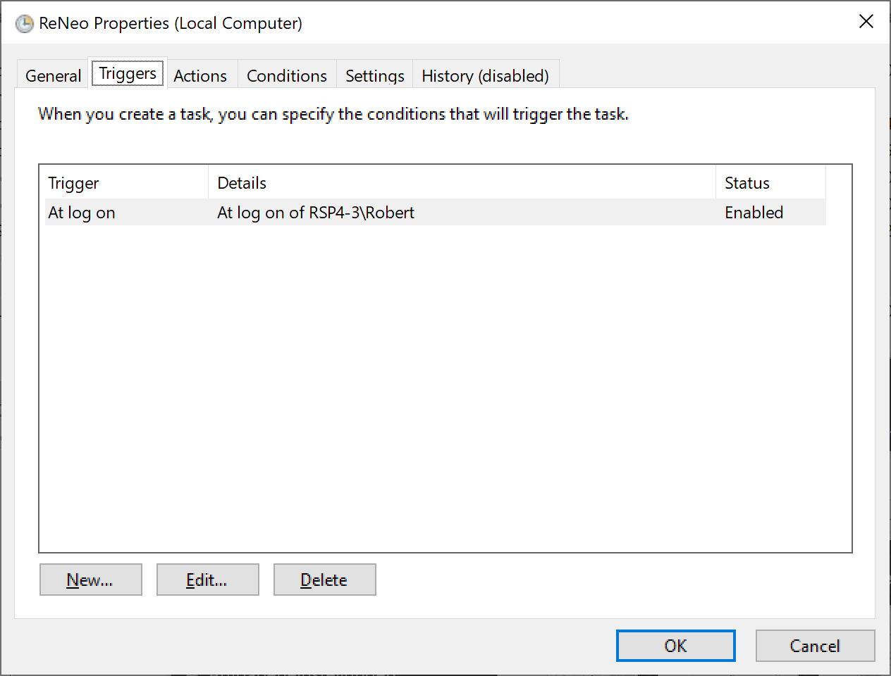
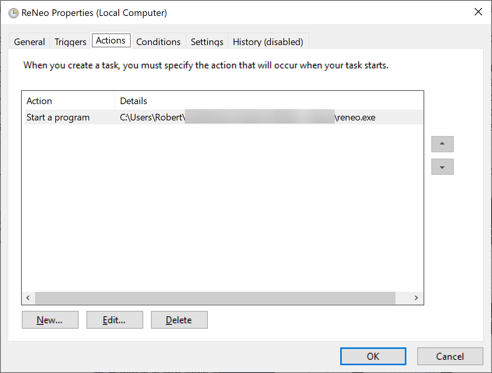
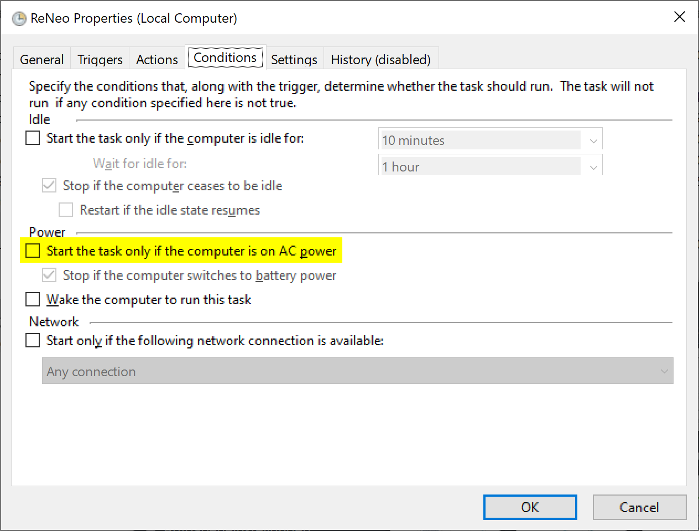
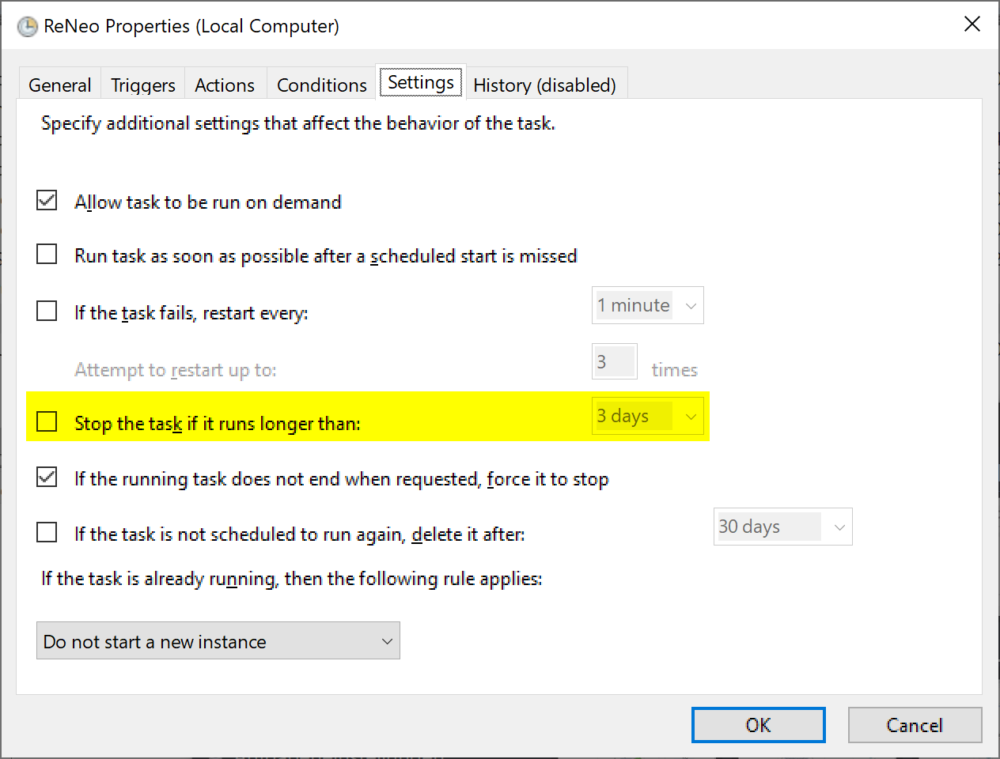

# Setting up ReNeo to start automatically

There are two ways to make ReNeo automatically start at logon. However, be aware that with both ways it's still *impossible to run ReNeo on the login screen* due to technical restrictions. This means you'll always have to enter your password using the native layout. If this is not acceptable, check if your preferred layout also provides a native driver DLL.

## Shortcut in startup directory

This method is easiest to setup but ReNeo won't work in applications running with administrative privileges.

Right click `reneo.exe` and select *Create shortcut*. Navigate to “C:\\Users\\[your user name]\\AppData\\Roaming\\Microsoft\\Windows\\Start Menu\\Programs\\Startup” and copy the newly created shortcut into this directory.

## Using Task Scheduler

This method is a little more involved but it can run ReNeo with administrative privileges, meaning it'll also work in elevated applications. First, make sure there is no ReNeo shortcut in the startup directory.

Use the start menu search to open the “Task Scheduler”. Create a new task called “ReNeo” with the following settings:

Add a trigger for *At log on* and choose your user.

As the action choose *Start a program* with the location of the ReNeo executable.

If you're on a laptop it's important to disable the highlighted power saving setting.

Finally, under *Settings* allow ReNeo to run for longer than three days.

